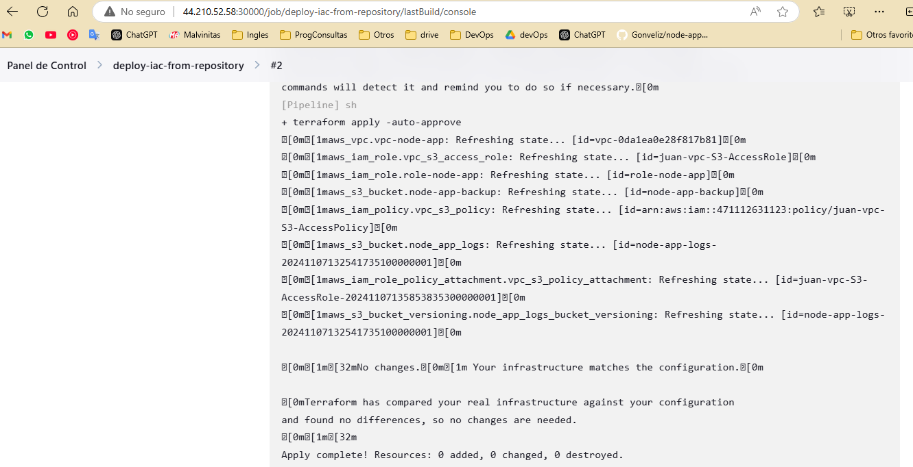
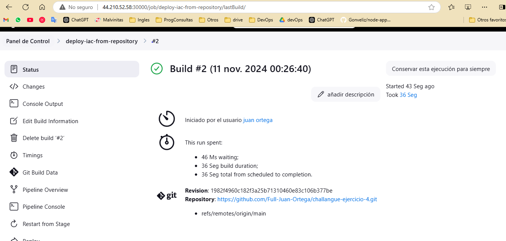

## Descripcion del ejercicio 4 - Pipeline para el despliegue de IaC de Terraform via Jenkins  
Vamos a necesitar un pipeline que despliegue IaC que anteriormente habiamos importado (Caso 2) utilizando Jenkins. Ademas de los recursos anteriores, tambien vamos a necesitar son los siguientes.  
- IAM Role con permisos para acceder a la vpc-node-app, permisos para acceder al bucket de s3 node-app-backup.
- S3 con versionamiento llamado con el prefix: node-app-logs-*.
NOTA: Este pipeline debera utilizar el state remoto del Caso 2.

## Solucion : 

[](https://www.loom.com/share/c6d096241c734a60867ed775765e542a?sid=0f5c9dc4-8e5b-46e5-87ae-dff192e2d81b)

## Levantar la ec2 "ejercicio-02" en la region us-east-1.

Si los recursos kubernetes no estan levantados :  

```bash
cd ./kubernetes
minikube start
kubectl apply -f .
kubectl port-forward svc/jenkins 30000:30000 --address 0.0.0.0 &
```

Link publico de jenkins en la ec2 : <http://44.210.52.58:30000/>

# Analisis resumido y depurado: 

Determine que el ejercicio requeria utilizar el pod que habia creado de jenkins en el caso 3 dado eso no utilice jenkins directamente en la ec2.

## Trabajo en mi pc local : 

1. [Prepare los recursos Terraform.](#2-traer-al-repositorio-los-archivos-tf-del-caso-dos-y-crear-los-nuevos-recursos)
2. [Genere una imagen de Docker con todas las dependencias para el pod y luego la subi al registry.](#6-imagen-docker-con-todas-las-dependencias)
3. [Cree el Jenkinsfile que desplegará el IaC.](#5-jenkins-pipeline)
4. Subí todos estos archivos en el repositorio.

## Trabajo en la EC2:

1. [Descargue la imagen del registry.](#8-descargar-y-desplegar-en-ec2)
2. Modifique el pod de Kubernetes para que despliegue esta nueva imagen de Jenkins.
3. Despliegue Jenkins públicamente.
4. [En el pod de Jenkins, instale AWS CLI, configure las credenciales para AWS y GitHub.](#4-dependencias-necesarias-dentro-del-pod)
5. Cree el pipeline que utiliza el Jenkinsfile del repositorio.


## 


# Paso a paso :

## 1. Cree el repositorio.

Empece utilizando un [repositorio que tengo para hado](https://github.com/Full-Juan-Ortega/devops-practices/tree/main/integrador/04-ejercicio)

Por consejo de mi mentor asignado termine haciendo un nuevo repositorio especifico para este ejercicio.(el que estan viendo)

**Nuevo aprendizaje :** Deje de usar la auth de git via access token y use ssh que es mas practico [utilice la documentacion oficial de github.](https://docs.github.com/es/enterprise-cloud@latest/authentication/connecting-to-github-with-ssh/generating-a-new-ssh-key-and-adding-it-to-the-ssh-agent)

```bash
ssh-keygen -t ed25519 -C "juan.ortega.it@gmail.com"  
eval "$(ssh-agent -s)"  
ssh-add .ssh/id_ed25519  
cat ~/.ssh/id_ed25519.pub  
ssh -T git@github.com 
```

## 2. Traer al repositorio los archivos tf del caso dos y crear los nuevos recursos.  


### Agregar s3.

Cree el bucket y para los requerimentos adicionales ( versionado y nombre prefix ) [estuve en la documentacion del proveedor oficial.(aws s3)](<https://registry.terraform.io/providers/hashicorp/aws/latest/docs/resources/s3_bucket>)

Para el versionado utilice el recurso [aws_s3_bucket_versioning](https://registry.terraform.io/providers/hashicorp/aws/latest/docs/resources/s3_bucket_versioning) 
  
Para verificar que todo este funcionando tal como necesito accedi a las propiedades del bucket.

### IAM Role con permisos para acceder a la vpc-node-app con permisos para acceder al bucket de s3 node-app-backup

Aca revise la seccion de documentacion del proveedor 
[IAM ROLE](https://registry.terraform.io/providers/hashicorp/aws/latest/docs/resources/iam_role) y 
[POLICY](https://registry.terraform.io/providers/hashicorp/aws/latest/docs/resources/iam_policy)


**Nuevo aprendizaje :** En este paso aprendi un poco mas de roles y policys , principalmente porque queria verificar que el rol y las policys creadas cumplieran con lo que necesitaba , para eso indague en el aws simulator y en la documentacion oficial.


## 3. Entorno local pruebas con docker y jenkins.

Como punto de partida use la imagen oficial [jenkins/jenkins](https://hub.docker.com/r/jenkins/jenkins).

### Contenedor jenkins con mapeo y volumen.  
`
docker run -dti -p 30000:8080 --restart=on-failure -v /home/juan/jenkins_data:/var/jenkins_home jenkins/jenkins:lts-jdk17  
`
### Config inicial:  

1) Cargue el codigo inicial.
2) Install sugested pluggins.
3) instalar aws credentials y cargar las credenciales.
4) con username&password cargar el usuario y access key de github.

## 4. dependencias necesarias dentro del pod.

### Terraform.

Segui la [instalacion oficial de terraform](https://developer.hashicorp.com/terraform/install?product_intent=terraform#linux) solo le agregue un autoaprove.  

Como root user :  
```bash 
docker exec -u root -it $(docker ps -l -q) /bin/bash    
apt update  
apt install -y wget gnupg lsb-release software-properties-common  
wget -O- https://apt.releases.hashicorp.com/gpg | gpg --dearmor -o /usr/share/keyrings/hashicorp-archive-keyring.gpg --yes
echo "deb [signed-by=/usr/share/keyrings/hashicorp-archive-keyring.gpg] https://apt.releases.hashicorp.com $(lsb_release -cs)   main" | tee /etc/apt/sources.list.d/hashicorp.list  
apt update && apt install terraform  
```

### AWS cli .

Segui la [instalacion oficial de AWS](https://docs.aws.amazon.com/cli/latest/userguide/getting-started-install.html) tuve que sacarle los sudo ya que estaba accediendo como root al contenedor.

Como root user :  
```bash 
docker exec -u root -it $(docker ps -l -q) /bin/bash  
curl "https://awscli.amazonaws.com/awscli-exe-linux-x86_64.zip" -o "awscliv2.zip"  
unzip awscliv2.zip  
./aws/install  
```

## 5. Jenkins Pipeline

Empeze siguiendo la [documentacion oficial de Jenkins](https://www.jenkins.io/doc/book/pipeline/getting-started/) y fui mejorando el pipeline haciendo las siguientes pruebas :  

1) Hello-World.
2) git clone.
3) test de como usar las credenciales en el pipeline. ( me listaba los buckets )
4) test de como usar terraform en el pipeline.
5) terraform apply y comprobar su funcionamiento.
6) Crear jenkinsfile en base a esto.
7) Crear el pipeline que despliega desde github.

**Nuevo aprendizaje** : Aprendi sobre la sintaxis y credenciales de groovy y jenkins.



## 6. Imagen docker con todas las dependencias.

Cree el dockerfile y use los comandos que venia trabajando ya para instalar aws cli y terraform. En el proceso hice algunos debugs normales como el mapeo de puertos y autoaprove de la instalacion.  

Por otro lado despues le hice un docker compose y mas tarde me di cuenta que lo iba a manejar con kubernetes asique lo elimine.

## 7. Subir la imagen a docker hub para despues usarla en la ec2 con minikube.

  
Esta imagen contiene los archivos tf , de k8 y jenkins. ( que despues no los use ya que use los archivos del repositorio).  

[Imagen en docker hub](https://hub.docker.com/layers/juanortegait/jenkins-with-dependencys/v1/images/sha256-74b30f1951907ca5368ffd996dacda65dcbbd13f222a9e1291eb59932dec0cbe?context=explore)  

```bash
docker build -t juanortegait/jenkins-with-dependencys:v1 .
docker push juanortegait/jenkins-with-dependencys
```
  
## 8. Descargar y desplegar en EC2.

Usar la imagen creada para que el pod de jenkins utilice los archivos que estan dentro de la misma imagen.

1) Pull a la imagen del registry -> `docker pull juanortegait/jenkins-with-dependencys:v1`
2) Modificar el pod kubernetes para que el pod despliegue esa imagen.  
3) Instalar aws credentials y crear las credenciales de aws y github en el pod de jenkins.
4) Crear el job que despliega el jenkinsfile del repositorio.


